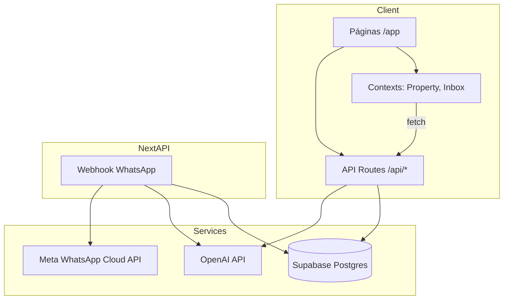
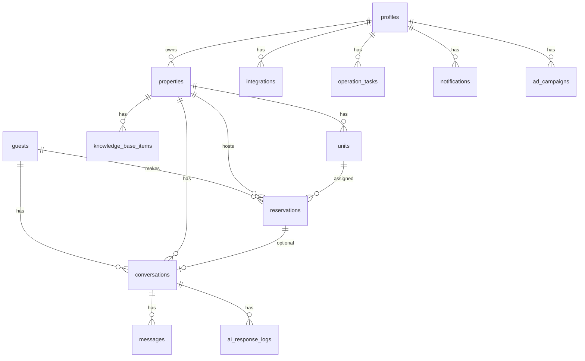

# InnIA — Especificación técnica y funcional completa

**Versión del documento:** generado desde el código en `PROYECTO2` (rama `main`, estado actual).  
**Propósito:** entregar contexto integral a un agente o equipo que diseñará una **versión experimental UX/UI** sin perder paridad funcional con el producto actual.  
**Alcance:** descripción del comportamiento real implementado; distingue explícitamente lo **real**, lo **parcial** y lo **preparado/stub**.

---

## Tabla de contenidos

1. [Visión general del producto](#1-visión-general-del-producto)  
2. [Stack y arquitectura](#2-stack-y-arquitectura)  
3. [Autenticación](#3-autenticación)  
4. [Onboarding](#4-onboarding)  
5. [Propiedades](#5-propiedades)  
6. [Reservas](#6-reservas)  
7. [Centro de mensajes](#7-centro-de-mensajes)  
8. [IA](#8-ia)  
9. [Clasificación de conversaciones](#9-clasificación-de-conversaciones)  
10. [WhatsApp](#10-whatsapp)  
11. [Instagram](#11-instagram)  
12. [Reportes](#12-reportes)  
13. [Operaciones](#13-operaciones)  
14. [Publicidad](#14-publicidad)  
15. [Settings / Configuración](#15-settings--configuración)  
16. [Base de datos](#16-base-de-datos)  
17. [Migraciones importantes](#17-migraciones-importantes)  
18. [UX/UI actual](#18-uxui-actual)  
19. [Limitaciones actuales](#19-limitaciones-actuales)  
20. [Roadmap / ideas](#20-roadmap--ideas)  
21. [Archivos importantes](#21-archivos-importantes)  
22. [Resultado esperado de este documento](#22-resultado-esperado-de-este-documento)

---

## 1. Visión general del producto

### Qué es InnIA

**InnIA** es un SaaS de gestión operativa para **alquileres temporarios** (casas, apartamentos, posadas, cabañas). Centraliza mensajes omnicanal, reservas, propiedades, tareas de limpieza/mantenimiento, huéspedes (CRM), finanzas básicas, reportes y configuración de integraciones — con un **copiloto de IA** orientado a responder consultas de huéspedes en nombre del anfitrión.

El nombre del paquete npm interno es `checkinn`; la marca de producto es **InnIA**.

### Problema que resuelve

Los anfitriones y pequeños operadores hoteleros suelen:

- Recibir consultas por **WhatsApp**, Instagram, Airbnb, Booking y email en silos distintos.
- Repetir respuestas sobre WiFi, mascotas, check-in, disponibilidad.
- Perder leads por demora en contestar.
- No tener un calendario operativo unificado por unidad.
- Depender de PMS hoteleros pesados, pensados para hoteles grandes, no para 1–10 unidades.

InnIA unifica **comunicación + contexto de propiedad + reserva (cuando existe) + IA** en una sola interfaz.

### Público objetivo

- **Dueños / anfitriones** de 1 a varias propiedades en Uruguay/Latam (español `es-UY` en formatos).
- Operadores que gestionan limpieza y mantenimiento.
- No está orientado (aún) a cadenas hoteleras enterprise.

### Filosofía del producto

| Principio | Implementación actual |
|-----------|------------------------|
| **Copiloto, no reemplazo** | La IA sugiere o envía respuestas; el dueño puede revisar, reclasificar, enviar manualmente. |
| **Operativo primero** | Inicio, inbox y reservas son el núcleo; finanzas/reportes son secundarios. |
| **Datos reales** | `preferApi()` evita inyectar mocks en UI de producción; demo bootstrap está deshabilitado. |
| **WhatsApp como canal estrella** | Integración más completa (webhook, envío, auto-proceso). |
| **Conocimiento de propiedad = IA** | WiFi, reglas, mascotas se sincronizan a `knowledge_base_items` para el pipeline. |

### Diferencia vs software hotelero tradicional

- Enfoque **temporario / unidad** (no front desk clásico).
- **Mensajería conversacional** como eje (no solo folio de huésped).
- **IA generativa** integrada al flujo de mensajes.
- UI **liviana** (Next.js + Supabase), no PMS monolítico.
- Clasificación por **intención** (`nueva_consulta`, `huesped_activo`, `comercial`) en lugar de solo “departamento de reservas”.

### Objetivo de automatización

1. **Clasificar** conversaciones automáticamente al entrar mensajes (regex + contexto de reserva).
2. **Responder** consultas frecuentes con OpenAI cuando hay conocimiento y confianza.
3. **Extraer** hechos del huésped (`guest_context`: fechas, personas, mascotas).
4. **Notificar** al dueño cuando hace falta revisión humana.
5. **Organizar** el inbox en pestañas por intención.

### Concepto de “IA silenciosa”

**Definición deseada:** la IA organiza (clasifica, prioriza, resume, prepara respuesta) **sin** enviar mensaje visible al huésped si el dueño no lo quiere.

**Estado actual (importante para UX experimental):**

| Capacidad | Estado |
|-----------|--------|
| Clasificar sin OpenAI | **Parcial** — solo en WhatsApp si `ai_auto_classification=true` y `ai_auto_process=false` (solo `applyIntentToConversation` en webhook). |
| Clasificar + generar respuesta sin enviar | **Parcial** — pipeline corre OpenAI; envío bloqueado si `ai_auto_reply_enabled=false`. |
| Resumen persistente en UI | **No** — panel IA no hidrata desde `ai_status` / logs al recargar. |
| Prioridad/labels automáticos | **Sí** — vía pipeline (`priority`, `labels`, `ai_status`). |

La clasificación de **categoría de inbox** (`intent_category`) **no usa OpenAI**; usa **regex** en `intent-classifier.ts`. OpenAI se usa para **respuesta**, decisión JSON y extracción de hechos.

### Enfoque copiloto operativo

El panel **Asistente IA** (`AiCopilotPanel`) en el Centro de mensajes muestra: estado, respuesta sugerida, fuentes, temas faltantes en KB, botón **Reprocesar con IA**. El dueño permanece en control; auto-envío solo si decisión + toggles + canal lo permiten.

---

## 2. Stack y arquitectura

### Framework y runtime

| Tecnología | Versión / uso |
|------------|----------------|
| **Next.js** | 15.x (App Router) |
| **React** | 19.x |
| **TypeScript** | 5.8 |
| **Tailwind CSS** | 4.x (`@import "tailwindcss"`) |
| **Supabase** | Auth + Postgres + RLS (`@supabase/ssr`, `@supabase/supabase-js`) |
| **OpenAI** | SDK 6.x, modelo `gpt-4.1-mini` |
| **Framer Motion** | Animaciones (inbox, inicio, finanzas) |
| **Recharts** | Gráficos finanzas |
| **Lucide React** | Iconografía |
| **Radix UI** | Primitivos (Dialog, Dropdown, Select, Tabs, etc.) |

### Despliegue

- **Vercel** (inferido por `VERCEL_URL` en `getAppBaseUrl()`).
- Variables en `.env.local` / Vercel: Supabase URL/keys, `OPENAI_API_KEY`, Meta/WhatsApp tokens, etc.

### Estructura de carpetas (alto nivel)

```
PROYECTO2/
├── src/
│   ├── app/                    # App Router: páginas + API routes
│   │   ├── app/                # Área autenticada (/app/*)
│   │   ├── api/                # REST handlers (38 routes)
│   │   ├── auth/callback/      # OAuth Supabase callback
│   │   ├── login, signup/
│   ├── components/             # UI por dominio
│   │   ├── inbox/, inicio/, layout/, properties/, reservations/, settings/, ...
│   ├── context/                # React Context (inbox, property, sidebar, toast)
│   ├── lib/                    # Lógica de negocio, DB, IA, integraciones
│   ├── types/                  # Tipos TS de dominio
│   ├── config/                 # Navegación
│   └── data/mock/              # Datos legacy (ya no inyectados en UI principal)
├── supabase/migrations/        # SQL schema evolutivo
├── middleware.ts               # Sesión Supabase + redirect onboarding
└── docs/                       # Documentación (este archivo)
```

### Frontend

- **Server Components** mínimos; la mayoría de páginas `/app/*` son `"use client"`.
- **Fetching:** `fetch` + hook `useApi` (sin React Query).
- **Estado global:** Context API (`PropertyProvider`, `InboxProvider`, `SidebarProvider`, `ToastProvider`).
- **Estilo:** tokens CSS en `globals.css` (olive, sand, cream, terracotta); utilidades `.ci-page`, `.ci-surface`, `.ci-sidebar`.

### Backend

- **API Routes** en `src/app/api/**/route.ts` con patrón `withAuthApiHandler` (sesión usuario).
- **Webhooks** públicos: WhatsApp, Instagram (sin auth de usuario).
- **Service role** (`createServiceRoleClient`) para webhooks y pipeline IA sin sesión de usuario.

### Flujo de información (diagrama)



### Organización del estado

| Estado | Dónde | Persistencia |
|--------|-------|--------------|
| Propiedad seleccionada | `PropertyContext` | Solo cliente (no localStorage) |
| Lista conversaciones + filtros inbox | `InboxContext` | Refetch `/api/conversations` cada 30s + focus |
| Análisis IA por conversación | `InboxContext.analyses` | **Solo memoria** hasta reprocesar |
| Sidebar expandido | `SidebarContext` | Hover desktop |
| Panel IA abierto | `InboxContext` | Cliente |

### Providers y layout

```
RootLayout
└── /app → AppLayoutGate
         ├── onboarding → solo ToastProvider
         └── resto → ToastProvider + PropertyProvider + AppShell
                      ├── AppSidebar
                      ├── Topbar (PropertySwitcher, búsqueda, notificaciones)
                      └── main → children (página)
```

`/app/inbox` envuelve además `InboxProvider` en su `page.tsx`.

---

## 3. Autenticación

### Supabase Auth

- Email/password (formularios `login-form`, `signup-form`).
- Callback: `src/app/auth/callback/route.ts` → redirige a `/app/inicio` o `next` param.
- **Middleware** (`src/lib/supabase/middleware.ts`):
  - Sin usuario en `/app/*` → redirect `/login?redirect=...`
  - Usuario en `/login` o `/signup` → redirect app
  - Usuario con `onboarding_completed=false` → redirect `/app/onboarding`

### Perfiles (`profiles`)

- Tabla `profiles` ligada a `auth.users(id)` (migración `002`).
- Trigger `handle_new_user` crea perfil al registrarse.
- Campos: `email`, `full_name`, `company_name`, `plan`, `onboarding_completed`, `phone`, `ai_settings` (JSONB, migración `008`).

### APIs

| Ruta | Función |
|------|---------|
| `GET/PATCH /api/profile` | Leer/actualizar perfil |
| `POST /api/profile/ensure` | Asegurar fila de perfil |

### RLS

- Políticas **owner-scoped**: `owner_id = auth.uid()` en tablas principales.
- Tablas hijas (units, messages) vía EXISTS sobre property/conversation del owner.
- Webhooks usan **service role** (bypass RLS).

### Sesión en cliente

- `useSession()` hook para usuario Supabase en componentes.

---

## 4. Onboarding

### Flujo UX (`OnboardingWizard`)

Pasos visibles (dinámico si `unit_count > 1`):

1. **Tus datos** — nombre, teléfono, empresa.
2. **Tu primera propiedad** — nombre, ubicación, tipo, horarios, reglas, WiFi, parking, mascotas, notas.
3. **Unidades** (opcional si >1 unidad) — nombre, capacidad por unidad.
4. **Conectá tus canales** — WhatsApp (manual: phone_number_id, token, etc.), Email, Airbnb iCal, Booking iCal.

### Finalización

- `POST /api/onboarding/complete` → `completeOnboarding()` en `lib/onboarding/complete-onboarding.ts`.

### Tablas tocadas

| Acción | Tabla |
|--------|-------|
| Actualizar dueño | `profiles` |
| Crear propiedad | `properties` |
| Crear unidades | `units` |
| Sync KB | `knowledge_base_items` (vía `syncPropertyKnowledgeFromProperty`) |
| Integraciones | `integrations` (whatsapp_business, email, airbnb, booking) |
| Marcar listo | `profiles.onboarding_completed = true` |

### APIs y componentes

- Componente: `src/components/onboarding/onboarding-wizard.tsx`
- Página: `src/app/app/onboarding/page.tsx`
- Sin `AppShell` completo (solo toast).

---

## 5. Propiedades

### Modelo de dominio (`Property`)

- Identificador UI: **slug** (`pdd`, `rocha`, `paloma` o dinámico).
- UUID Supabase: `dbId`.
- Campos operativos para IA: `wifi`, `wifiName`, `wifiPassword`, `houseRules`, `parkingInfo`, `petPolicy`, `checkInInstructions`, `lockInstructions`, `emergencyContact`, `checkInTime`, `checkOutTime`.
- `smartLockOnline` — flag para pantalla Cerraduras (no integración real de cerradura).
- `platforms[]` — canales declarados.

### Unidades (`Unit`)

- Por propiedad: `name`, `capacity`, `status`, `notes`.
- CRUD: `/api/properties/[id]/units`, `/api/properties/[id]/units/[unitId]`.

### Knowledge base IA

- Tabla `knowledge_base_items` por `property_id` + `category` (wifi, check_in, pets, etc.).
- **Sync automático** al guardar propiedad: `lib/property-knowledge-sync.ts`.
- Estados: `completo` | `incompleto` | `faltante`.
- API: `GET/POST /api/knowledge-base?property=...`

### UI

- `src/app/app/propiedades/page.tsx` — grid de cards + editor lateral.
- `PropertyEditor`, `PropertyCard`, `property-edit-panel.tsx`.

### APIs principales

| Método | Ruta |
|--------|------|
| GET/POST | `/api/properties` |
| GET/PATCH/DELETE | `/api/properties/[id]` |
| GET | `/api/properties/[id]/full` (property + units + knowledge) |

### Relaciones

```
auth.users → profiles
profiles → properties (owner_id)
properties → units
properties → knowledge_base_items
properties → reservations, conversations, operation_tasks
```

---

## 6. Reservas

### Modelo (`Reservation`)

| Campo | Descripción |
|-------|-------------|
| `check_in` / `check_out` | DATE, constraint `check_out > check_in` |
| `status` | confirmada, check-in, check-out, pendiente, cancelada |
| `payment_status` | pagado, pendiente, parcial |
| `lock_code_status` | activo, pendiente, expirado (UI operativa) |
| `platform` | Airbnb, Booking, WhatsApp, etc. |
| `unit_id` | FK obligatorio |
| `guest_id` | FK obligatorio |

### Prevención de conflictos

- Constraint Postgres `EXCLUDE` (GiST): no solapamiento de fechas por `unit_id` si status ≠ cancelada.
- API `POST /api/reservations` llama `assertNoReservationOverlap` antes de insertar.

### Calendario (`PmsTimelineCalendar`)

- Vista: semana (7), quincena (14), mes (30 días).
- Eje Y: unidades agrupadas por propiedad.
- Barras de reserva coloreadas por plataforma.
- **Vacío:** si no hay reservas, usa `placeholderUnits` desde propiedades del owner; overlay “No hay reservas cargadas…” + CTAs.
- `rangeStart` por defecto: **hoy** (`getDefaultRangeStart()`).

### Reservas manuales vs sincronizadas

| Origen | Estado |
|--------|--------|
| Manual | `POST /api/reservations` — **real** |
| iCal Airbnb/Booking | Sync guarda config y cuenta eventos; **importación a tabla `reservations` no completa** (mensaje API: “disponible pronto”) |

### Relación con conversaciones

- `conversations.reservation_id` opcional.
- Clasificación `huesped_activo` fuerte si hay `reservation_id`.
- Panel IA muestra fechas de reserva si existe vínculo.

### Página

- `src/app/app/reservas/page.tsx` + `ReservationDetailPanel`.

---

## 7. Centro de mensajes

### Arquitectura UI (3 columnas + header)

```
┌──────────── AppShell (sidebar global) ────────────┐
│ Topbar (global, excepto diseños futuros)         │
├──────────── InboxWorkspace ───────────────────────┤
│ Header: título, badge pendientes, toggle panel IA │
├──────────┬─────────────────────┬─────────────────┤
│ Lista    │ MessageThread       │ AiCopilotPanel  │
│ convers. │ (chat + composer)   │ (colapsable)    │
└──────────┴─────────────────────┴─────────────────┘
```

**Mobile:** lista OR chat; panel IA en sheet/overlay; FAB para abrir IA en tablet.

### Context: `InboxProvider` (`src/context/inbox-context.tsx`)

| Estado / acción | Descripción |
|-----------------|-------------|
| `items` | Conversaciones desde API |
| `intentTab` | nueva_consulta \| huesped_activo \| comercial \| todos |
| `channelFilter` | WhatsApp, Instagram, Airbnb, Booking, all |
| `filter` | all \| unread \| review |
| `search` | Texto en nombre, preview, propiedad |
| `analyses` | Mapa id → `AiAnalysis` (**client-only**) |
| `processWithAi` | POST `/api/ai/process-message` |
| `sendOwnerMessage` | WhatsApp send API, email API, o messages API |
| `sendAiReply` | Envía `suggestedResponse` guardada en memoria |
| `reclassifyIntent` | PATCH conversación + `intent_manual_override: true` |
| `refetch` | Cada 30s + window focus + evento `innia:data-ready` |

### Tabs de intención

- Contadores calculados en cliente desde `intentCategory` real.
- Filtro: `intentTab !== "todos"` → `c.intentCategory === intentTab`.
- Conversaciones `otro` solo visibles en tab **Todos**.

### Lista de conversaciones (`ConversationList`)

- Tabs con contadores.
- Búsqueda, filtros canal y estado (todas/sin leer/revisar).
- Cards con avatar, preview, `IntentCategoryBadge`, badges IA/urgente.

### Hilo de mensajes (`MessageThread`)

- Burbujas por `sender`: guest, owner, ai.
- Framer Motion en entrada de mensajes.
- Composer con Enter para enviar.
- Selector de reclasificación manual de intent.
- Acciones: marcar resuelta, crear tarea, links CRM/reserva.

### Panel IA (`AiCopilotPanel`)

- Colapsable (~11px rail → ~220–280px expandido).
- Estados: idle, auto_sent, needs_review, insufficient_info (mapeo desde API).
- Botón **Reprocesar con IA**.
- Enviar respuesta sugerida si aplica.
- **Limitación:** tras auto-proceso webhook, UI puede mostrar “Sin analizar” hasta reprocesar manualmente.

### Componente legacy

- `ai-assistant-panel.tsx` existe pero el workspace usa **`ai-copilot-panel.tsx`**.

### APIs

| Método | Ruta | Uso |
|--------|------|-----|
| GET | `/api/conversations` | Lista completa con mensajes embebidos |
| GET/PATCH | `/api/conversations/[id]` | Detalle / actualizar unread, intent, priority |
| POST | `/api/conversations/[id]/messages` | Mensaje owner (no-WhatsApp) |
| POST | `/api/ai/process-message` | Pipeline IA manual/reproceso |
| POST | `/api/integrations/whatsapp/send` | Salida WhatsApp |
| POST | `/api/integrations/email/send` | Salida email |
| POST | `/api/integrations/instagram/send` | Stub/envío preparado |

### Modelo conversación (campos clave)

```typescript
Conversation {
  intentCategory: IntentCategory;
  intentManualOverride?: boolean;
  aiStatus?: string;        // auto_sent, needs_review, ...
  urgency: normal | revisar | urgente;
  labels: ConversationLabel[];
  platform: Platform;
  messages: Message[];
  reservationId?: string;
}
```

### Auto-refresh

- Intervalo 30s en `InboxProvider`.
- Evento custom `innia:data-ready` tras onboarding/sync.

---

## 8. IA

### Integración OpenAI

| Parámetro | Valor |
|-----------|-------|
| Modelo | `gpt-4.1-mini` |
| Temperature | 0.35 |
| Max tokens | 500 |
| Formato | `response_format: { type: "json_object" }` |

### Archivos del pipeline

| Archivo | Rol |
|---------|-----|
| `lib/ai/pipeline.ts` | Orquestación principal `runAiPipeline`, `autoProcessIncomingGuestMessage` |
| `lib/ai/config.ts` | System prompt, umbrales confianza |
| `lib/ai/build-context.ts` | Prompt de usuario con propiedad, KB, reserva, historial |
| `lib/ai/parse-response.ts` | Parse JSON + reglas de seguridad |
| `lib/ai/category-prompts.ts` | Sufijos por `intent_category` |
| `lib/ai/conversational-style.ts` | Post-proceso tono (sin “Hola [nombre]” repetido) |
| `lib/ai/conversation-entities.ts` | Regex + merge `guest_context` |
| `lib/ai/owner-settings.ts` | Toggles en `profiles.ai_settings` |

### Flujo `runAiPipeline` (resumen)

1. Cargar mensaje guest, conversación, propiedad, KB, reserva, historial (24 msgs).
2. **Clasificar** `intent_category` si `ai_auto_classification !== false`.
3. Llamar OpenAI con system + user prompt.
4. Parsear decisión: `auto_responder` \| `requiere_revision` \| `informacion_insuficiente` \| `escalar_dueno`.
5. Merge `guest_context` con `extractedFacts`.
6. Post-procesar texto respuesta.
7. Reglas server: escalación, propuesta comercial → revisión.
8. Si `auto_responder` + confianza + toggles + canal WhatsApp → `deliverWhatsAppForOwner`.
9. Si otro canal y auto-reply on → `insertMessageForOwner` (sin Meta).
10. Crear `ai_response_logs`, actualizar `conversations` (ai_status, labels, priority, unread).
11. Notificación tipo `ia` al owner.

### Auto processing (WhatsApp inbound)

```
Webhook guarda mensaje
  → applyIntentToConversation (si classification on)
  → autoProcessIncomingGuestMessage
       → si ai_auto_process_enabled false: STOP
       → si reply off AND classification off: STOP
       → runAiPipeline
```

### Auto reply — condiciones

- `profiles.ai_settings.ai_auto_reply_enabled !== false`
- `integrations.config.ai_auto_reply_enabled !== false` (WhatsApp)
- Decisión `auto_responder`
- `intent_category !== "comercial"`
- Confianza ≥ 0.72 (`AI_DECISION_THRESHOLDS`)
- Canal WhatsApp para envío real Cloud API

### Qué usa OpenAI vs regex

| Función | Motor |
|---------|--------|
| `intent_category` (inbox tabs) | **Regex** (`intent-classifier.ts`) |
| Respuesta al huésped | **OpenAI** |
| Decisión auto/revisión/escalar | **OpenAI** + reglas server |
| Extracción fechas/personas/mascotas | **OpenAI** (`extractedFacts`) + regex (`conversation-entities.ts`) |
| Detección urgencia/comercial en pipeline | **Regex hints** + OpenAI |

### `ai_response_logs`

- Por cada procesamiento: `generated_response`, `used_knowledge`, `missing_information`, `ai_decision`, `auto_sent`.

### `guest_context` (JSONB en `conversations`)

- Campos típicos: `check_in`, `check_out`, `guests_count`, `pets`.
- Migración **009** obligatoria.

### `ai_status` en conversación

| Valor | Significado UI |
|-------|----------------|
| `auto_sent` | Respondido automáticamente |
| `needs_review` | Requiere revisión |
| `insufficient_info` | Falta KB del dueño |
| `escalated` | Escalado |
| null / idle | Sin analizar en panel (si no hay analysis en memoria) |

### Settings IA (`/api/settings/ai`)

```json
{
  "ai_auto_classification": true,
  "ai_auto_reply_enabled": true,
  "ai_auto_process_enabled": true,
  "channel_rules": { "whatsapp": { "auto_reply": true }, ... }
}
```

UI en `settings-dashboard.tsx`.

---

## 9. Clasificación de conversaciones

### Valores `intent_category`

| Valor | Label UI | Uso |
|-------|----------|-----|
| `nueva_consulta` | Nueva consulta | Lead / disponibilidad / precio |
| `huesped_activo` | Huésped activo | En estadía o con reserva |
| `comercial` | Comercial | Influencer, canje, marketing |
| `otro` | Otro | Resto; solo tab “Todos” |

### Cómo se clasifica

Función `classifyConversationIntent()` — orden de reglas:

1. Vacío + reserva → `huesped_activo`
2. Patrones comerciales → `comercial`
3. Si `hasReservation` → casi siempre `huesped_activo`
4. Patrones huésped activo sin consulta → `huesped_activo`
5. Patrones consulta → `nueva_consulta`
6. Default → `otro`

**Nota:** parámetro `channel` se pasa pero **no se usa** en el clasificador.

### Dónde se guarda

- `conversations.intent_category` (TEXT, default `otro`)
- `conversations.intent_manual_override` (BOOLEAN) — si true, auto-clasificación no sobrescribe DB

### Cuándo se ejecuta

| Evento | Clasificación |
|--------|---------------|
| Webhook WhatsApp mensaje nuevo | `applyIntentToConversation` antes del pipeline |
| `runAiPipeline` | Re-aplica si `ai_auto_classification` on |
| Manual UI | PATCH con override true |
| Instagram / Email inbound | **No automático** (Instagram stub) |

### Limitaciones

- No usa historial en webhook (solo último mensaje).
- Con reserva vinculada, casi todo → `huesped_activo` aunque el texto sea consulta nueva.
- No es LLM — sinónimos raros caen en `otro`.
- UI panel no refleja reclasificación automática sin refetch (sí actualiza badge en lista tras refetch).

---

## 10. WhatsApp

### Integración Meta Cloud API

- Cliente: `lib/integrations/whatsapp-cloud.ts` (envío, verificación webhook).
- Config en `integrations`: `provider = 'whatsapp_business'`, `config` JSONB + `access_token_encrypted`.

### Webhook

- **GET** `/api/webhooks/whatsapp` — verificación `hub.verify_token` (env + tokens en DB).
- **POST** — procesa payload; usa `after()` de Next.js para responder 200 rápido y procesar async.

### Procesador (`webhook-processor.ts`)

1. Resolver integración por `phone_number_id` (`resolveWhatsAppIntegration`).
2. Extraer mensaje texto (text, button).
3. `findOrCreateGuest` por teléfono.
4. `findOrCreateConversation` canal `whatsapp`.
5. Insertar `messages` (sender_type guest).
6. Actualizar conversación (preview, unread, timestamps).
7. Notificación `mensaje`.
8. **`applyIntentToConversation`** si classification enabled.
9. **`autoProcessIncomingGuestMessage`**.

### Envío saliente

- `deliverWhatsAppMessage` / `deliverWhatsAppForOwner` en `send-outbound.ts`.
- Normalización teléfono: `normalizeWhatsAppPhone`.
- Logs: `[whatsapp:outbound]`, debug en config JSONB.

### OAuth / Embedded signup (preparado)

| Ruta | Estado |
|------|--------|
| `GET /api/integrations/whatsapp/oauth/start` | Genera URL Meta si env vars presentes |
| `GET /api/integrations/whatsapp/oauth/callback` | Completa conexión |
| Panel `whatsapp-integration-panel.tsx` | UI conexión manual + OAuth |

Requiere: `META_APP_ID`, `META_APP_SECRET`, `META_CONFIG_ID`, `NEXT_PUBLIC_APP_URL`.

### Owner resolution

- Integración atada a `owner_id` en tabla `integrations`.
- Índice en `config->>'phone_number_id'`.

### Qué funciona realmente

- Recepción webhook texto.
- Persistencia guest/conversation/message.
- Clasificación intent en webhook.
- Auto-proceso IA + auto-reply (con toggles y OpenAI configurado).
- Envío owner/IA por Cloud API con token válido.

### Qué está preparado / parcial

- OAuth Meta (depende de env).
- Debug routes `/api/debug/whatsapp-events`.
- Reacciones multimedia limitadas (solo text/button).

### Qué falta

- Estados de entrega leídos en UI (statuses en webhook se ignoran).
- Soporte completo multimedia.
- Retry/failed message queue visible en UI.

---

## 11. Instagram

### Estado actual: **preparación / stub**

| Pieza | Estado |
|-------|--------|
| `integrations.provider = 'instagram'` | UI panel conexión |
| Webhook `POST /api/webhooks/instagram` | Solo log + `{ received: true }` |
| `POST /api/integrations/instagram/send` | Stub (preparado) |
| Adapter `instagram-adapter.ts` | Estructura |
| Inbox filtro plataforma Instagram | UI lista |
| Reportes métricas Instagram | Cuenta conversaciones channel=instagram |

### Arquitectura prevista

- Misma forma que WhatsApp: webhook Meta → guest/conversation/message → applyIntent → pipeline.
- Config: `instagram_business_account_id`, `page_id`, `access_token`.

### Relación con Meta

- Misma app Meta potencial; verify token compartido con WhatsApp en webhook GET.

---

## 12. Reportes

### Página `/app/reportes`

- Métricas **reales** desde `GET /api/reports/metrics` → `getReportsMetrics()`.

### KPIs calculados

| Métrica | Fuente |
|---------|--------|
| Consultas Instagram | conversations channel=instagram + intent nueva_consulta |
| Reservas desde Instagram | conversations instagram + reservation_id |
| Mensajes auto IA | messages.ai_auto_sent |
| Campañas activas | ad_campaigns status borrador/listo |
| Propuestas comerciales | intent comercial |
| Consultas convertidas | nueva_consulta + reservation_id |
| Top canales | agrupación por channel |
| Preguntas frecuentes | regex sobre last_message_preview |

### Insights IA en reportes

- Arrays `insights`, `knowledgeBaseItems`, `suggestedAutoReplies` en página están **vacíos** (constantes `[]`) — componentes UI existen pero sin datos API.

### Export

- CSV de métricas vía `downloadCsv`.

---

## 13. Operaciones

### Página `/app/operaciones`

- Kanban de tareas: `operations-kanban.tsx`.
- Tipos: `limpieza`, `mantenimiento`.
- Estados: Pendiente, En curso, Completado, Problema detectado.

### APIs

- `GET/POST /api/tasks`
- `PATCH /api/tasks/[id]`

### Relación con reservas / inbox

- Crear tarea desde conversación (`createTaskFromConversation` en inbox).
- `operation_tasks.reservation_id` opcional.
- Título/descripción desde contexto conversación.

### Datos

- **100% Supabase** vía API (no mock en operaciones).

---

## 14. Publicidad

### Estado: **MVP funcional (sin publicar en Meta)**

- Tabla `ad_campaigns` (migración 008).
- CRUD: `GET/POST /api/ad-campaigns`.
- UI: `/app/publicidad` — formulario campaña, estados `borrador` | `listo_para_publicar`.

### Campos campaña

`name`, `objective`, `budget`, fechas, `channel` (instagram default), `ad_copy`, `cta`, `property_id`, `status`.

### Meta Ads

- **No hay** publicación real a Meta Ads API.
- Mensaje UI: “lista para publicar (simulación)”.

### Relación con WhatsApp

- Objetivos y CTAs mencionan “Consultar por WhatsApp”.
- Métricas de conversión en reportes vinculan consultas/reservas, no spend de ads.

---

## 15. Settings / Configuración

### Página `/app/configuracion`

- `settings-dashboard.tsx` + paneles:
  - **WhatsApp** (`whatsapp-integration-panel.tsx`)
  - **Instagram** (`instagram-integration-panel.tsx`)
  - **Integraciones** generales (`integrations-panel.tsx`) — email, iCal Airbnb/Booking

### Toggles IA (perfil)

| Toggle | Key | Default |
|--------|-----|---------|
| AutoProcess al recibir mensaje | `ai_auto_process_enabled` | true |
| Respuestas automáticas | `ai_auto_reply_enabled` | true |
| Clasificación automática | `ai_auto_classification` | true |

Persistencia: `PATCH` vía lógica en dashboard → `updateOwnerAiSettings`.

### API integraciones

- `GET /api/integrations` — lista providers + config sanitizada (sin secrets).
- Guardado config: mutaciones en `integrations` con `config` JSONB.

### iCal sync

- `POST /api/integrations/ical/sync` — fetch URL iCal, cuenta eventos VEVENT, **no importa reservas aún**.

---

## 16. Base de datos

### Diagrama entidad-relación (simplificado)



### Tablas principales

#### `profiles`
- PK = `auth.users.id`
- `onboarding_completed`, `ai_settings` JSONB, `phone`, `plan`

#### `properties`
- `owner_id`, `slug`, datos operativos (wifi, reglas, etc.), `smart_lock_online`

#### `units`
- `property_id`, `capacity`, `status`

#### `guests`
- `owner_id`, contacto, `validation_status`, JSONB historial/incidentes/reviews

#### `reservations`
- Fechas, montos, `platform`, overlap constraint, `lock_code_status`

#### `conversations`
- `channel`, `intent_category`, `intent_manual_override`, `guest_context` JSONB
- `ai_status`, `labels[]`, `priority`, `unread`, `reservation_id`

#### `messages`
- `sender_type` (guest|owner|ai), `ai_generated`, `ai_auto_sent`, `external_message_id`

#### `integrations`
- `provider` UNIQUE per owner: whatsapp_business, instagram, email, airbnb, booking
- `config` JSONB, tokens encrypted columns

#### `knowledge_base_items`
- Por property + category UNIQUE

#### `operation_tasks`
- Tipo, estado, checklist JSONB

#### `notifications`
- Tipos: mensaje, reserva, ia, integracion, tarea

#### `ai_response_logs`
- Auditoría decisiones IA

#### `ad_campaigns`
- Campañas publicitarias draft

### Enums / convenciones texto

- Estados como TEXT (no ENUM Postgres) — flexibilidad pero menos validación DB.
- Plataformas en UI: PascalCase (`WhatsApp`); DB channel: lowercase (`whatsapp`, `instagram`).

### RLS resumen

- Todo scoped por `auth.uid()` = owner.
- Service role para webhooks/admin mutations en pipeline.

---

## 17. Migraciones importantes

| # | Archivo | Qué agrega | Obligatoria |
|---|---------|------------|-------------|
| 001 | `001_initial_schema.sql` | Schema completo: properties, units, guests, reservations, conversations, messages, integrations, KB, tasks, notifications, ai_logs, RLS | **Sí** |
| 002 | `002_profiles_auth.sql` | `profiles`, trigger signup, RLS | **Sí** |
| 003 | `003_claim_demo_owner.sql` | Utilidad demo (legacy) | Opcional |
| 004 | `004_onboarding_integrations.sql` | `profiles.phone`, `properties.property_type`, `integrations.config` | **Sí** |
| 005 | `005_fix_signup_profile_trigger.sql` | Fix trigger perfiles | **Sí** si problemas signup |
| 006 | `006_remove_mock_data.sql` | Limpieza datos demo | Mantenimiento |
| 007 | `007_cleanup_test_users_and_residual_data.sql` | Limpieza test users | Mantenimiento |
| 008 | `008_intent_campaigns_instagram.sql` | `intent_category`, `intent_manual_override`, `profiles.ai_settings`, `ad_campaigns` | **Sí** para inbox IA moderno |
| 009 | `009_conversation_guest_context.sql` | `conversations.guest_context` JSONB | **Sí** para memoria IA |

**Orden:** aplicar 001 → 002 → 004 → 005 → 008 → 009 (003/006/007 según entorno).

---

## 18. UX/UI actual

### Filosofía visual

- **Warm hospitality SaaS:** fondo beige `#f5f0e8`, cards crema, acento verde oliva `#3e4f3c` / primary `#5c6b4a`.
- Bordes suaves, `rounded-[20px]`–`22px`, sombras verdes muy suaves.
- Tipografía: Geist Sans (`--font-geist-sans`).
- Componentes utilitarios: `.ci-page`, `.ci-header-band`, `.ci-section-title`.

### Layout global

- **Sidebar** verde oliva (`ci-sidebar`), colapsa a 88px, expande a 240px on hover.
- **Topbar:** búsqueda global, selector propiedad, notificaciones, perfil.
- Contenido en `main` con scroll.

### Inicio (`/app/inicio`)

- Hero personalizado con fecha y nombre.
- KPI cards (ocupación, reservas hoy, mensajes, tareas).
- Próximas llegadas + card mensajes.
- Tareas urgentes, integraciones, **HomeInsightCarousel** (carrusel insights dinámicos).

### Inbox

- Layout 3 columnas; estilo operativo (no clon WhatsApp Web).
- Tabs intención, chips canal, panel IA lateral.

### Dashboard / otras páginas

- Patrón `ci-page` + `PageSection` con animación stagger.
- Finanzas: gráficos Recharts (datos transacciones **vacíos** actualmente).

### Qué funciona bien

- Navegación clara por dominio.
- Selector global de propiedad coherente.
- Inbox funcional end-to-end con WhatsApp real.
- Tokens de color consistentes en la mayoría de pantallas.

### Problemas / inconsistencias UX

| Área | Problema |
|------|----------|
| Panel IA | No hidrata estado tras auto-proceso; muestra “Sin analizar” |
| Inbox vs Topbar | Altura `calc(100dvh-4rem)` — header duplicado en workspace |
| Finanzas | UI rica pero sin transacciones API |
| Reportes | Sección insights mock vacía |
| Cerraduras | UI de tarjetas sin integración hardware real |
| iCal | Usuario cree que sincroniza reservas; solo cuenta eventos |
| Clasificación | Manual override poco visible vs automática |
| Email | Depriorizado en copy pero aún en onboarding |

---

## 19. Limitaciones actuales

### Qué falta (no implementado)

- Importación iCal → `reservations`.
- Instagram mensajería end-to-end.
- Publicación Meta Ads.
- Integración cerraduras reales (solo flag `smart_lock_online`).
- API finanzas / transacciones reales.
- Modo “solo clasificar” con LLM (clasificación es regex).
- Hidratar panel IA desde DB al cargar inbox.
- Resumen diario server-side persistente (carousel es cliente con datos live).
- Crear reserva desde UI calendario (CTA existe; flujo modal no completo).
- Dark mode.

### Qué está parcial

| Feature | Grado |
|---------|-------|
| IA silenciosa | Parcial (toggles existen; pipeline siempre llama OpenAI si auto_process on) |
| Auto-clasificación | Parcial (solo WhatsApp inbound + pipeline) |
| Reportes insights | Parcial (métricas sí, cards insight no) |
| Email send | Parcial (API existe, uso limitado) |
| CRM huéspedes | Parcial (API guests, UI CRM) |

### Qué es mock / legacy

- `src/data/mock/*` — **no** usado en flujos principales (`preferApi` devuelve `[]`).
- `lib/inbox-ai.ts` — lógica mock análisis; **no** usada por `InboxProvider` (solo `formatTimestamp`).
- Finanzas: `transactions = []` hardcoded.
- Reportes: arrays insight vacíos.
- Demo bootstrap: deshabilitado explícitamente.

### Problemas conocidos

- `intent_classifier` con reserva fuerza `huesped_activo`.
- `getDefaultRangeStart` fue corregido a “hoy” (antes fecha fija demo).
- Conflicto nombres paquete `checkinn` vs marca InnIA.
- Reportes/Finanzas pueden confundir al usuario (UI sin datos).

---

## 20. Roadmap / ideas (documentado en producto)

- **IA silenciosa completa:** clasificar/resumir/priorizar sin envío ni costo OpenAI obligatorio.
- **Copiloto operativo:** timeline unificado check-in + limpieza + mensajes.
- **Clasificación inteligente:** LLM ligero o híbrido con historial.
- **Automatización seguimiento:** consultas sin respuesta → recordatorios.
- **Instagram** messaging + métricas reales.
- **Publicidad:** API Meta Ads, vinculación con conversiones WhatsApp.
- **Cerraduras inteligentes:** APIs TTLock/Nuki, códigos por reserva.
- **guest_context** enriquecido en UI (mostrar fechas extraídas en panel).
- **Memory** conversacional más larga y resúmenes compactos.
- **Operational AI:** sugerir tareas limpieza desde check-out detectado.

---

## 21. Archivos importantes

### Páginas App Router (`src/app/app/`)

| Ruta | Archivo | Descripción |
|------|---------|-------------|
| `/app/inicio` | `inicio/page.tsx` | Dashboard principal |
| `/app/inbox` | `inbox/page.tsx` | Centro de mensajes |
| `/app/reservas` | `reservas/page.tsx` | Calendario PMS |
| `/app/propiedades` | `propiedades/page.tsx` | CRUD propiedades |
| `/app/operaciones` | `operaciones/page.tsx` | Kanban tareas |
| `/app/crm` | `crm/page.tsx` | Base huéspedes |
| `/app/finanzas` | `finanzas/page.tsx` | Dashboard finanzas |
| `/app/reportes` | `reportes/page.tsx` | Métricas |
| `/app/publicidad` | `publicidad/page.tsx` | Campañas |
| `/app/configuracion` | `configuracion/page.tsx` | Settings |
| `/app/onboarding` | `onboarding/page.tsx` | Wizard inicial |
| `/app/cerraduras` | `cerraduras/page.tsx` | Vista cerraduras |

### Contexts

| Archivo | Rol |
|---------|-----|
| `context/inbox-context.tsx` | Estado completo inbox + IA UI |
| `context/property-context.tsx` | Propiedad seleccionada + lista |
| `context/sidebar-context.tsx` | Hover expand sidebar |
| `context/toast-context.tsx` | Notificaciones toast |

### Layout

| Archivo | Rol |
|---------|-----|
| `components/layout/app-shell.tsx` | Shell sidebar + topbar + main |
| `components/layout/app-sidebar.tsx` | Nav principal |
| `components/layout/topbar.tsx` | Header global |
| `components/layout/property-switcher.tsx` | Filtro propiedad global |
| `components/layout/app-layout-gate.tsx` | Providers por ruta |

### Inbox

| Archivo | Rol |
|---------|-----|
| `components/inbox/inbox-workspace.tsx` | Layout 3 paneles |
| `components/inbox/conversation-list.tsx` | Lista + tabs + filtros |
| `components/inbox/message-thread.tsx` | Chat + composer |
| `components/inbox/ai-copilot-panel.tsx` | Panel asistente IA |
| `components/inbox/intent-category-badge.tsx` | Badge categoría |

### IA

| Archivo | Rol |
|---------|-----|
| `lib/ai/pipeline.ts` | Pipeline principal |
| `lib/ai/config.ts` | Prompts y modelo |
| `lib/ai/build-context.ts` | Contexto para OpenAI |
| `lib/ai/parse-response.ts` | Reglas post-OpenAI |
| `lib/conversations/intent-classifier.ts` | Clasificación regex |
| `lib/conversations/apply-intent.ts` | Persistir intent en DB |

### WhatsApp

| Archivo | Rol |
|---------|-----|
| `lib/integrations/whatsapp/webhook-processor.ts` | Inbound messages |
| `lib/integrations/whatsapp/send-outbound.ts` | Outbound delivery |
| `lib/integrations/whatsapp-cloud.ts` | Meta API client |
| `app/api/webhooks/whatsapp/route.ts` | Endpoint webhook |

### Base de datos

| Archivo | Rol |
|---------|-----|
| `lib/db/queries.ts` | Lecturas autenticadas |
| `lib/db/mutations.ts` | Escrituras autenticadas |
| `lib/db/mappers.ts` | DB row → tipos dominio |
| `lib/db/owner-queries.ts` | Lecturas service role pipeline |
| `lib/db/owner-mutations.ts` | Escrituras service role pipeline |

### APIs (lista completa)

`ad-campaigns`, `ai/process-message`, `conversations`, `conversations/[id]`, `conversations/[id]/messages`, `debug/whatsapp-events`, `demo/bootstrap`, `guests`, `guests/[id]`, `integrations`, `integrations/email/send`, `integrations/ical/sync`, `integrations/instagram/send`, `integrations/sync`, `integrations/whatsapp/*`, `knowledge-base`, `notifications`, `onboarding/complete`, `profile`, `profile/ensure`, `properties`, `properties/[id]`, `properties/[id]/full`, `properties/[id]/units`, `reports/metrics`, `reservations`, `search`, `settings/ai`, `stats`, `tasks`, `tasks/[id]`, `webhooks/whatsapp`, `webhooks/instagram`.

### Hooks / utilidades

| Archivo | Rol |
|---------|-----|
| `lib/hooks/use-api.ts` | Fetch con estado |
| `lib/hooks/use-session.ts` | Sesión Supabase cliente |
| `lib/prefer-api.ts` | Sin fallback mock |
| `lib/home-insights.ts` | Generación insights carousel Inicio |
| `lib/calendar-utils.ts` | Timeline calendario |
| `lib/property-units.ts` | Unidades desde reservas/propiedades |

---

## 22. Resultado esperado de este documento

Un agente de diseño UX/UI (p. ej. Codex) debería poder:

1. **Entender el producto** como copiloto de alquileres temporarios, no PMS enterprise.
2. **Mapear pantallas** y flujos críticos: onboarding → propiedades → inbox WhatsApp → reservas.
3. **Respetar datos reales** y no inventar mocks de reservas/conversaciones en prototipos de producción.
4. **Distinguir** clasificación regex vs respuesta OpenAI vs envío automático.
5. **Proponer mejoras visuales** (p. ej. hidratar panel IA, inbox full-bleed, finanzas conectadas) sin romper contratos API listados.
6. **Saber migraciones** 008 y 009 obligatorias para features IA/inbox modernos.
7. **Identificar stubs** (Instagram, iCal import, Ads, finanzas transacciones) para no prometerlos como hechos en UI experimental.

### Variables de entorno críticas (referencia)

```
NEXT_PUBLIC_SUPABASE_URL
NEXT_PUBLIC_SUPABASE_ANON_KEY
SUPABASE_SERVICE_ROLE_KEY
OPENAI_API_KEY
WHATSAPP_VERIFY_TOKEN
META_APP_ID / META_APP_SECRET / META_CONFIG_ID
NEXT_PUBLIC_APP_URL
RESEND_API_KEY (email opcional)
```

---

*Documento generado por análisis estático del repositorio InnIA/PROYECTO2. No modifica código fuente.*
